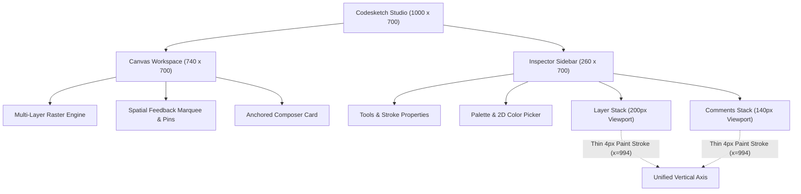
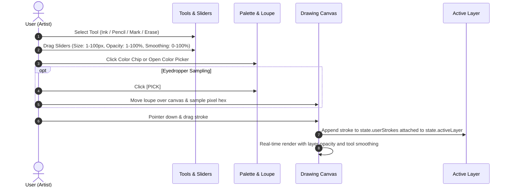
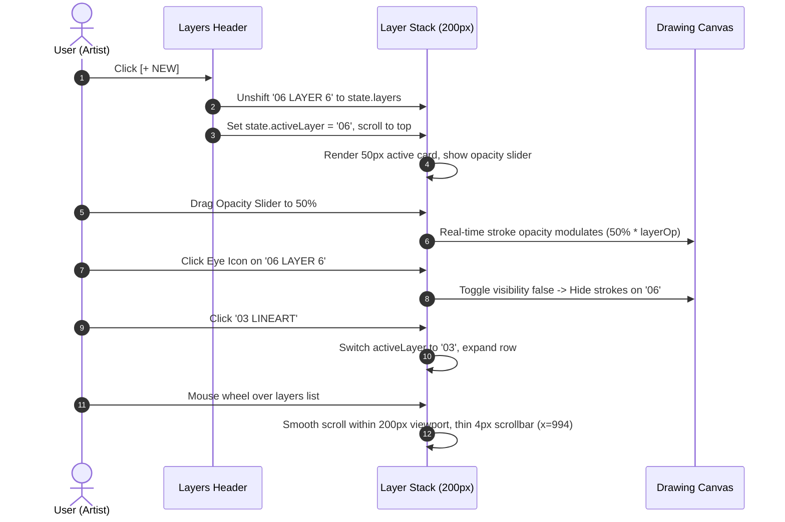
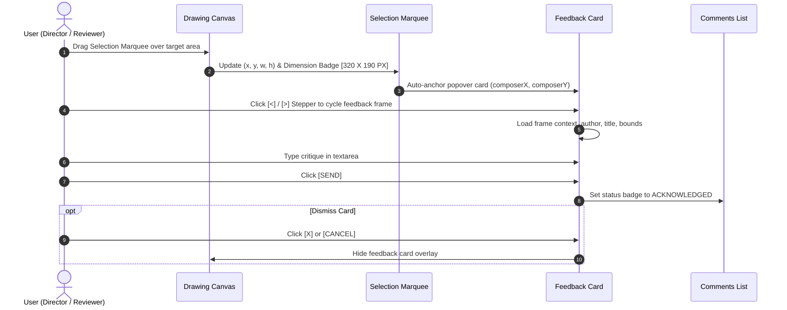
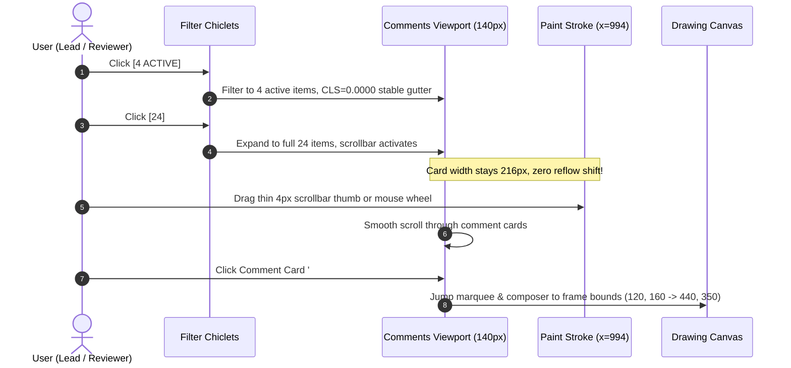

# Codesketch Studio: Production Handover Specification & User Journeys

> [!IMPORTANT]
> **READ-ONLY REFERENCE FREEZING NOTICE**
> The interactive mockup implementation located at [`artifacts/mockup/index.html`](file:///private/tmp/codesketch-designer-20260910-fresh/artifacts/mockup/index.html) and [`artifacts/mockup/overflow_demo.html`](file:///private/tmp/codesketch-designer-20260910-fresh/artifacts/mockup/overflow_demo.html) is **FROZEN** as the definitive read-only reference specification.
> 
> The engineering team must rebuild the production Codesketch application based **strictly on the necessary features defined herein and no more**. Avoid scope creep, unnecessary dependencies, standard browser font overlays, or layout reflow shifts.

---

## 1. Executive Summary & Core Pillars

Codesketch Studio is a native, tactile 2D digital art and spatial feedback tool designed for high-precision design reviews, director critiques, and multi-layer illustration.

### The Three Invariants
1. **Pure Custom Vector Typography**: All text rendered anywhere inside the studio application uses our proprietary vector stroke glyph engine (`GLYPHS` via `draw_text()`). No standard browser fonts, system sans-serif, or monospace fonts may be injected into the studio container.
2. **Zero Cumulative Layout Shift (`CLS = 0.0000`)**: Content transitions, filter toggling, and scrollbar appearances never cause card reflow or layout jumps. The right sidebar maintains a permanent **24px reserved gutter** (`cardW = 216px`).
3. **Unified Thin Paint-Stroke Aesthetics**: Floating, natural paint-stroke scrollbars (`size = 4`, color `#94A3B8`) on a shared vertical track (`x = 994`) serve both the Layers and Comments sections without intrusive track wires.

---

## 2. Visual Architecture & Live State Reference

*Figure 1: Sidebar inspector showing unified thin 4px paint stroke scrollbars at `x=994` in both Layers and Comments sections.*

*Figure 2: Complete Studio interface with custom vector typography, spatial marquee, feedback popover card, and stable gutter.*

---

## 3. Comprehensive User Journeys

### Journey 1: Canvas Drawing, Tool Selection & Pigment Customization

#### Steps & Behaviors:
1. **Tool Switcher**:
   - Artist clicks one of four tools in the inspector: `INK`, `PENCIL`, `MARK`, `ERASE` (`top: 70px`, `y: 70..98`).
   - Active tool button highlights in `#0284C7`; inactive tools remain `#94A3B8`.
   - `ERASE` automatically matches background wash `#0F172A` and doubles brush size.
2. **Stroke Sliders (Direct Touch & Drag)**:
   - Three continuous sliders: **Size** (1–100 px), **Opacity** (1–100%), **Smoothing** (0–100%).
   - Dragging the track smoothly updates canvas rendering with instant visual feedback on thumb positions.
3. **Pigment Selection & Color Picker**:
   - **Quick Palette**: 8 preset chips (`Lamp Black`, `Graphite Slate`, `Cobalt Blue`, `Cerulean Cyan`, `Emerald Green`, `Yellow Ochre`, `Cadmium Red`, `Titanium White`). Active chip has blue focus ring.
   - **Color Picker Popover**: Click hex badge (`#2563EB`) to open.
     - **2D Sat/Val Matrix**: 228x62px spectrum field with draggable reticle.
     - **1D Hue Slider**: Horizontal gradient bar with circular thumb (`0°..360°`).
     - **Eyedropper `[ PICK ]`**: Activates canvas loupe (`28px` diameter) with live hex readout. Clicking any pixel samples color and sets active pigment.
     - **Recent Mixes**: Bottom row of 6 recently applied pigments.
     - **Action `[ APPLY PIGMENT ]`**: Commits color to active brush and palette history.
4. **Drawing Execution**:
   - Clicking and dragging on the canvas (`0..740px`) draws natural vector strokes.
   - Strokes automatically associate with `state.activeLayer`.

---

### Journey 2: Layer Stack Management & Dynamic Composition

#### Steps & Behaviors:
1. **Layer Hierarchy**:
   - Stack displays layers top-down (e.g. `05 HIGHLIGHTS` down to `00 CANVAS FILL`).
   - Default active layer is `03 LINEART`.
2. **Creating New Layers (`+ NEW`)**:
   - Clicking `+ NEW` (`top: 252px, left: 932px`) computes max existing layer number + 1.
   - Creates new layer object: `{ num: '06', name: 'LAYER 6', op: '100%', opacityNum: 100, vis: true }`.
   - Prepends layer to index 0, sets as `state.activeLayer`, and resets `state.layerScrollY = 0`.
3. **Active Row State & Opacity Slider**:
   - Active layer expands to `50px` height with a light blue `#F0F9FF` background card and `#0284C7` left accent bar.
   - Exposes an inline horizontal **OPACITY** slider (`810px..938px`).
   - Dragging the slider directly modulates stroke transparency on that layer.
4. **Layer Visibility Toggle**:
   - Clicking the eye button (`left: 964px`) toggles `layer.vis`.
   - Open eye: Ellipse with white pupil.
   - Closed/hidden eye: Dimmed ellipse with diagonal slash stroke.
   - Associated strokes on the canvas immediately hide or show.
5. **Layer Scrolling & Zero-CLS Viewport**:
   - Bounded viewport: `y = 272px` to `y = 472px` (`height = 200px`).
   - When layers exceed 200px, mouse wheel scrolls the list smoothly (`state.layerScrollY`).
   - Floating thin 4px paint stroke scrollbar displays on right edge at `x = 994`.
   - Layer rows are strictly clipped: **they never bleed into or shift the COMMENTS section below**.

---

### Journey 3: Spatial Feedback, Selection Marquee & Popover Card

#### Steps & Behaviors:
1. **Spatial Marquee Selection**:
   - Interactive translucent blue wash (`rgba(2, 132, 199, 0.14)`) with alternating two-tone dashed border (`#0284C7` and `#FFFFFF`).
   - 4 corner handles + dragging badge.
   - Top dimension badge displays live size: e.g. `[ 320 X 190 PX ]`.
   - Dragging inside the marquee repositions the target region across the canvas.
2. **Anchored Feedback Composer Card**:
   - Floating popover card anchored to the right handle of the selection marquee (`composerX = marqueeX + marqueeW + 12`, clamped to canvas).
   - Dynamic pointer arrow connects the marquee edge to the card.
   - Header shows Frame Stepper: `[<] [#03/12 CRAG LINEART] [>]` and close button `[X]`.
   - Displays metadata: Bounds coordinates, Layer stack association (`03 LINEART, 02 PENCIL`).
   - Critique textarea with custom vector typography support.
   - Actions: `[ CANCEL ]` (dismisses card) and `[ SEND ]` (commits critique, updates badge to `ACKNOWLEDGED`).
3. **Canvas Spatial Pins & Group Badges**:
   - Prior comment pins rendered on canvas (e.g. Pin `#1 ACK` at `(62, 262)`, Pin `#5 ACT` at `(560, 390)`).
   - Spatial cluster badge: `[ 3 NOTES v ]` at lake shoreline grouping multiple dense notes.
   - Inactive ghost pins rendered with subtle translucent opacity.
   - Clicking any pin centers the marquee and opens the feedback flow.

---

### Journey 4: Comment Inspection & Zero-CLS Review Navigation

#### Steps & Behaviors:
1. **Filter Chiclets**:
   - Chiclet `[ 24 ]`: Shows all project comments. Active chiclet highlighted in `#0284C7`.
   - Chiclet `[ 4 ACTIVE ]`: Filters list to only pending actionable comments.
   - **Zero-CLS Invariant**: Toggling between 4 items and 24 items never causes card width reflow or horizontal jumping.
2. **Comment Cards**:
   - Fixed width: `216px` (from `x = 752px` to `x = 968px`).
   - Card displays: Item number (`#24`), label (`ATMOSPHERIC HAZE`), status badge (`ACTIVE` blue / `ACK` grey), coordinate bounds (`240,80 -> 560,200`).
   - Selected card displays `#F0F9FF` background and `#0284C7` accent bar.
   - Clicking a card immediately repositions canvas selection marquee to the frame's bounds.
3. **Thin 4px Paint Stroke Scrollbar**:
   - Floating rounded paint stroke thumb: `size = 4`, color `#94A3B8`.
   - Aligned at **`x = 994`**, perfectly collinear with the Layers scrollbar above.
   - Vertical track: `top = 518px`, `bottom = 650px` (`height = 132px`).
   - Supports direct pointer dragging (`#scrollbarDragZone`), track clicks, and mouse wheel.
   - Engine footer badge shows live metric: `CLS 0.0000 STABLE GUTTER` in green (`#10B981`).

---

### Journey 5: Studio Workspace Management

1. **Saving Project**:
   - Clicking `[ SAVE ]` in header (`top: 11px, left: 872px`) triggers instant visual confirmation.
   - Header badge briefly shows saved state for 2.5s before reverting.
2. **Feedback Flow Toggle**:
   - Clicking `[ FB ]` in header (`top: 11px, left: 818px`) toggles the visibility of the feedback card and spatial selection marquee.
3. **Sidebar Panel Collapse**:
   - Clicking `[ >| ]` collapse button (`top: 11px, left: 958px`) collapses the right sidebar, expanding the canvas width from `740px` to `1000px`.
   - When collapsed, a discrete `[ EXPAND ]` button mounts in the top right.

---

## 4. Technical Architecture Specifications

### Component Coordinates & Layout Matrix

| Component | Left ($x$) | Top ($y$) | Width ($w$) | Height ($h$) | Visual Properties |
| :--- | :--- | :--- | :--- | :--- | :--- |
| **Studio Container** | 0 | 0 | 1000 | 700 | `#0F172A`, 4px rounded radius |
| **Canvas Workspace** | 0 | 0 | 740 (or 1000) | 700 | Expansive widescreen drawing area |
| **Sidebar Inspector** | 740 | 0 | 260 | 700 | Dark panel `#0F172A`, border left 1px |
| **Tools Row** | 760 | 70 | 225 | 28 | 4 tools (Ink, Pencil, Mark, Erase) |
| **Size Slider** | 750 | 130 | 240 | 26 | Range 1–100 px |
| **Opacity Slider** | 750 | 156 | 240 | 26 | Range 1–100 % |
| **Smoothing Slider** | 750 | 182 | 240 | 26 | Range 0–100 % |
| **Color Chips** | 754 | 222 | 232 | 24 | 8 circular chips (diameters 16–24px) |
| **Layers Header** | 756 | 252 | 232 | 24 | `LAYERS` label + `+ NEW` action |
| **Layers Viewport** | 748 | 272 | 248 | 200 | Bounded viewport with clipping |
| **Layers Scrollbar** | 994 | 276 | 4 (stroke) | dynamic | Thin 4px paint stroke, `#94A3B8` |
| **Comments Header** | 756 | 476 | 228 | 38 | `COMMENTS` label + filter chiclets |
| **Comments Viewport** | 750 | 514 | 240 | 140 | Clipped comments viewport |
| **Comments Card** | 752 | cy | 216 | 35 | Fixed 216px card width (Zero-CLS) |
| **Comments Gutter** | 968 | 514 | 24 | 140 | Reserved stable gutter (Zero-CLS) |
| **Comments Scrollbar**| 994 | 518 | 4 (stroke) | dynamic | Thin 4px paint stroke, `#94A3B8` |
| **Footer Metric** | 756 | 666 | 232 | 24 | `CODESKETCH ENGINE V2`, `CLS 0.0000` |

---

## 5. Scope Boundary: What NOT to Build

To prevent feature creep and preserve the clean, focused architecture established in this milestone, the engineering team must adhere to the following negative requirements:

> [!CAUTION]
> ### Strict Exclusions
> 1. **NO HTML Text Overlays inside the Studio**: Never introduce standard `
`, ``, or `
` text nodes on top of the studio canvas. All typography must render via vector strokes using the custom `GLYPHS` engine.
> 2. **NO Auto-Reflowing Scrollbars**: Never implement browser-native `overflow: auto` or scrollbars that push, squeeze, or reflow cards horizontally. The 24px reserved gutter is mandatory.
> 3. **NO 3D Bevels or Gloss Textures**: Never apply drop-shadow filters, plastic highlights, or 3D gradient skeuomorphism to scrollbars or layer rows. Maintain the flat 2D paint-stroke aesthetic.
> 4. **NO Monospace or System Font Overrides**: Never style inputs or overlays with browser monospace or sans-serif typography.
> 5. **NO Unbounded Layer Stack Expansion**: The layer list must remain strictly contained within its 200px viewport, using `state.layerScrollY` to navigate excess layers without colliding with the comments panel.
