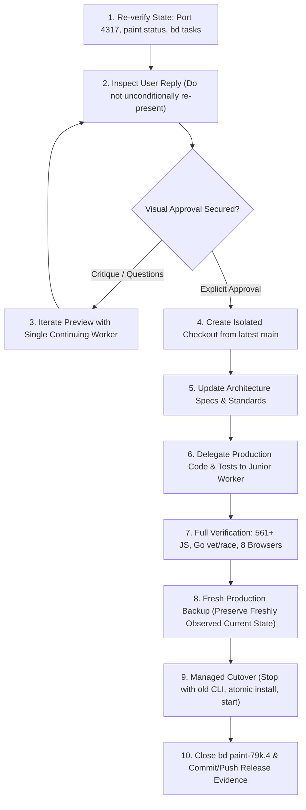

# Codesketch Manager Handoff — Studio Responsive Monitor-Width & Sizing

## 1. Executive Summary & Handover Intent

This document transfers lead managerial, architectural, and design context for Codesketch Studio. The immediate work focuses on responsive monitor-width layout, minimal feedback presentation, and sidebar sizing corrections following user critique of the September 11, 2026 production release.

This handoff is written in response to the explicit user request:
> *"can you do a handoff and dump all your context to the repo. then git push origin main"*

This document replaces the stale pre-existing untracked handoff file with authoritative, up-to-date context. This task is strictly a manager handoff context dump and documentation transfer; no full test suites or verification runs are to be executed for this task alone. Full test suites (`npm run verify`, browser scenarios) belong to subsequent implementation release gating.

### Critical Governance Fence: Handoff Is Not Visual Approval
Under [`AGENTS.md`](../AGENTS.md), before substantial UI implementation may begin, the lead must show the user a concrete mockup of the hierarchy and user journey, request critique, and wait for **explicit visual approval**. Automated tests, technical checks, and manager handoffs do not establish design approval. Technical completion and user visual acceptance remain strictly separate gates.

The full-width monitor proposal located at [`docs/previews/monitor-width/`](previews/monitor-width/) is **PROPOSED** and strictly awaiting user visual critique and acceptance (`paint-79k.4` remains `IN_PROGRESS`).

### Successor Presentation Flow
Do **not** unconditionally re-present the preview: it has already been presented to the user in commit `7e73132` and preceding turns. The incoming manager must first read the user's latest response. Only if visual approval is still pending, or if the user raises questions or critique, should the preview be adjusted or re-presented.

---

## 2. Authoritative Production Runtime & Repository State

*Verified read-only status as of 2026-09-12 03:50:12 UTC (September 11, 23:50 EDT):*

### Production Service & Process Health
- **Sole Production Endpoint**: `http://127.0.0.1:4317`
- **Process Status**: Healthy, running detached `node` process under PID `58115`
- **Instance ID**: `751728e9-6bb3-46cd-b44e-0681f2d56b9f`
- **Runtime Digest**: `3291063155817cc0ba297efe9432d267e381e851f3f6d6510d9b7f71fabf04ab`
- **Installed Native CLI**: `/Users/chrismck/.local/bin/paint` (confirmed via `file` command as `Mach-O 64-bit arm64` executable)
  - SHA-256: `c48fe98ecda56fab9412595028f6046ac94dfffd02f59fdf868112d991856465` (matches candidate binary in isolate `/private/tmp/codesketch-studio-polish-20260911/bin/paint`)
  - **Stale Root Binary Warning**: The root workspace binary `/Users/chrismck/Code/codesketch/bin/paint` is **STALE** (SHA-256 `1a67fef9676cc9e6ab5341c64a1477c5a53885a6efa96bf7d4c2286d634245f9`). Do **not** use root `bin/paint` as the current runtime CLI; always use installed `~/.local/bin/paint` matching the isolate candidate.
- **Persistence Paths**:
  - Durable data: `/Users/chrismck/Library/Application Support/codesketch`
  - Ephemeral runtime cache: `/Users/chrismck/Library/Caches/codesketch`

### Live Artwork State (Must Be Preserved)
- **History Counter**: `cursor 1400 / 1400 history entries` (progressed from the 1398 release baseline via live painting)
- **Layers**: 10 layers
- **Feedback Comments**: 2 comments (latest comment text: `"right here :)"`)
- **Playback Engine**: `paused` (speed: `8x`, remaining: `0`, active: `null`)
- **Grant State**: `requiresGrant: true`, `activeGrant: null`
- **Storage Health**: `storageError: null`

### Crucial Production Safeguards
> [!CAUTION]
> **Artwork Preservation & Discard Scope**: An earlier user statement on September 10 (*"oh we can just delete the current canvas apinting xP"*) applied solely to that historical pre-reset session. It **must not** be interpreted as authorization to discard subsequent or current live artwork (1,400 history entries across 10 layers). Preserve artwork, project document, comments, and playback state by exact structural JSON equality; byte-verify backup files. Do not promise byte-identical entire runtime persistence across process restarts.

> [!WARNING]
> **Outage Policy (SEV0) & Testing Policy**: Port 4317 is sole production. Any interruption is SEV0. Never stop, kill, or replace production processes outside an authorized lead-managed cutover. All tests and development must use isolated loopback ports (ephemeral ports preferred, port 0) and separate data directories (temporary durable persistence allowed in test scratch dirs). Never default to or touch port 4317. Never use `.studio/session.json` for tests or development.

### Repository State
- **Root Path**: `/Users/chrismck/Code/codesketch`
- **Branch & Commit**: `main` at `7e73132` (*"Present full-width Studio sizing preview for user critique"*), pushed to [`https://github.com/ChrisMckerracher/codesketch`](https://github.com/ChrisMckerracher/codesketch).
- **Git HEAD Snapshot Notice**: Note that HEAD commit `7e73132` is a pre-handoff snapshot; the final commit hash incorporating this handoff will necessarily be created later by the lead manager upon final commit and push.
- **Working Tree**: Clean with respect to source code. Unstaged changes are restricted to `.beads/interactions.jsonl` (51 pre-existing lines). Exact untracked extra files to preserve:
  - `docs/reference-mockup/build_interactive_engine.py`
  - `docs/reference-mockup/canvas_artwork.png`
  - `docs/reference-mockup/generate_exact_html.py`
  - `docs/reference-mockup/index_old_minimal.html`
  - `docs/reference-mockup/test_exact.html`
  - `docs/reference-mockup/update_overflow_html.py`

---

## 3. User Feedback, Critique History & Visual Approval Fences

### Core Product Goal
Codesketch is a collaborative local painting instrument for humans and autonomous agents. The user observes strokes appear in real time, pauses the instrument, and leaves spatial feedback notes on canvas regions. The standard of polish is that of a premium Mac creative application (comparable to Figma UI3, see [Explore design files](https://help.figma.com/hc/en-us/articles/15297425105303-Explore-design-files) and [Our approach to designing UI3](https://www.figma.com/blog/our-approach-to-designing-ui3/)), with minimal text, high visual density, and intuitive spatial controls. It is **not** a generic dashboard or feature-bloated canvas.
Canonical artist instruction skill path: `/Users/chrismck/.codex/skills/paint-with-references/SKILL.md` (accessible via native CLI `paint --artist-skill`; see also `paint guide` for authoritative interface and agent reference).

### Chronological Review & Approval Milestones
1. **Initial UI Reset (September 10)**: Technically verified and deployed, but rejected by user because it bypassed explicit visual design review.
2. **Reconstruction Isolate & Vector Baseline Approval (September 11)**: Built in `/private/tmp/codesketch-reconstruction-20260911` (source commit `cfb0cf6`, record `0c8322e`). Closed issues `paint-2y5`, `paint-at5`, and `paint-c36`. User reviewed and explicitly approved the vector Studio reconstruction mockup ([`docs/reference-mockup/approved-studio.png`](reference-mockup/approved-studio.png)).
3. **Reconstruction & Post-Release Polish Releases (September 11)**: Delivered dual-canvas vector rendering, smooth feedback dragging, inline layer renaming, and unboxed comment rows (`abd084b` and `4576a7c`).
4. **Latest User Critique (September 11, Post-Release)**:
   > *"Couple misses. the Write Feedback should have no text. the theme of htis app has been minimal text. Some of your sizing hcoices are pretty wonky! Let's use the whole width of our monitors please. The comments section you have lots of width to use in the sidebar and arent. This is closer but you still didnt quite meet my quality bar, and didnt match the mockup. I also frown on you using a team of 12 for this work. A team or 1 or 2 is plenty"*

### Deconstruction of Critique & Attribution Distinction
- **Empty Feedback Composer ("no text")**: The popover card must initialize completely blank. Note that the "minimal text" interpretation (e.g. completely blank textarea with no pre-filled body copy and no visible placeholder text) is a **manager proposal design decision**, not a verbatim user requirement.
- **Sidebar Width Utilization**: In the live production application, the sidebar width is 260 design units. In the mockup and proposed layout, the sidebar is allocated 360 CSS pixels. Avoid claiming the user complained about a live 360px sidebar; rather, the user noted that the comments section had lots of unused width in the sidebar (due to short stubs and unboxed margins).
- **Typography Sizing Choice**: The choice of `10–12px` glyph height (`scale 1.50`, ~10.5px) and unboxed wordwrapping is a **manager proposal design decision** to keep text readable without reintroducing unnecessary copy, rather than a verbatim user quote.
- **Full Monitor Width ("use the whole width of our monitors")**: Supersedes the historical fixed 1000px centered canvas box. The workspace must expand to fill `100vw × 100vh`, anchoring the sidebar to the right edge and utilizing the available horizontal expanse.
- **Staffing Cap ("team of 1 or 2 is plenty")**: Strict prohibition on agent swarms, fan-outs, and intermediary management layers. Work must remain limited to the lead manager plus at most one continuing worker.

---

## 4. Approved Architectural Baseline & System Contracts

All production Studio work must adhere to the frozen baseline and architecture standards established on September 11, 2026:

### Reference Mockup Baseline
- **Frozen Mockup Reference**: [`docs/reference-mockup/index.html`](reference-mockup/index.html) and [`docs/reference-mockup/overflow_demo.html`](reference-mockup/overflow_demo.html)
  - Each frozen reference HTML file independently has the exact same SHA-256 hash: `ff8ca047b1a56b252180bccdbe0baee57e6fb13dfe9fdefef640af9e5c2b6d64` (not a combined hash; they are byte-identical copies).
- **Visual Reference Images**:
  - Studio Layout: [`docs/reference-mockup/approved-studio.png`](reference-mockup/approved-studio.png)
  - Custom Scrollbars: [`docs/reference-mockup/approved-scrollbars.png`](reference-mockup/approved-scrollbars.png)
- **Staged Archive**: `artifacts/studio-mockup-unified`
- **Baseline Specifications**:
  - [`docs/specs/studio-reconstruction.feature`](specs/studio-reconstruction.feature)
  - [`docs/plans/architect/studio-reconstruction.md`](plans/architect/studio-reconstruction.md)
  - [`docs/standards/interface.md`](standards/interface.md)
  - [`docs/standards/architecture.md`](standards/architecture.md)

### Non-Negotiable System Architecture
1. **Dual-Canvas Surface**:
   - `#painting-canvas`: Renders raw artwork marks, watercolor/ink washes, and live agent brush strokes.
   - `#ui-canvas`: Renders interactive overlays, selection marquees, dimension badges, pin callouts, comment lists, and all typography using the vector `GLYPHS` engine.
2. **Semantic DOM Backing (`#control-host`)**:
   - Zero visible HTML text nodes.
   - Invisible semantic DOM elements (`<button>`, `<input>`, `<textarea>`) positioned exactly behind canvas elements to provide native keyboard focus, screen-reader accessibility, clipboard copy/paste, and IME composition events.
3. **Pure Custom Vector `GLYPHS` Engine**:
   - Visible lettering is rendered purely as stroked vector paths from the approved 5×7 unit coordinate glyph dictionary (`createVector(ctx)`).
   - Uniform aspect ratio scaling; non-uniform stretching is strictly prohibited.
4. **Five Core User Journeys (Production Baseline Contract)**:
   - *Journey 1*: Tool selection (Ink, Pencil, Marker, Erase), stroke properties (size 1–100px, opacity 1–100%, smoothing 0–100%), 8 pigment swatches + spectrum/hue slider + eyedropper, and target layer attachment.
   - *Journey 2*: Layer stack management: visibility toggle, opacity slider, overflow scrolling, and inline layer renaming. (There is **no drag reordering**).
   - *Journey 3*: In-app spatial feedback: marquee drag creation, opposite-anchor resizing, dimension badge (`320 X 190 PX`), drag handle (`DRAGGING`), anchored popover composer card, and canvas pin badges (`#1 ACK`, `#5 ACT`, `3 NOTES v`).
   - *Journey 4*: Comments feed: filtering (`ALL` / `ACTIVE`), unboxed row presentation, active thread selection, spatial bounds display, real lifecycle status badges (`[ACTIVE]` / `[ACK]`), and autonomous thread replies.
   - *Journey 5*: Top-level controls: real `SAVE` indicator, sidebar collapse (`<| STUDIO`), genuine autonomous agent `ACK`. Interaction relies on native keyboard focus and activation, `Enter`/`blur` for rename commit, and `Escape` for cancel. (There are **no invented B, E, Space, or 1–4 shortcuts**).
   > [!IMPORTANT]
   > Reference proposal features must **not** be asserted as shipped.
5. **Strict Governance & Technology Constraints**:
   - **Zero Third-Party Production Dependencies**: Native JavaScript ES modules, HTML5 Canvas, modern CSS, and Node built-ins for the Studio; Go standard library for the native CLI. External dependencies require formal proposals and explicit user approval.
   - **No Backward Compatibility Debt**: Compatibility shims, legacy migrations, fallback formats, and schema adapters are permanently forbidden. Changes update callers, specs, and tests simultaneously.
   - **Communication Protocol**: HTTP polling for synchronization; WebSockets are prohibited.
   - **Latest Grant/Pause Protocol**: Before native mutations, read current `paint status` and follow `paint guide` for the current document generation, control epoch, and legitimate grant. Preserve a human pause until continuation is authorized. Never invent grant tokens or impersonate human API sources. Human feedback `SEND` explicitly authorizes its submitted correction; stale `generation`/`artRevision`/`controlEpoch` fences reject outdated submissions. The observed `requiresGrant=true`, `activeGrant=null`, `paused speed8` values are a timestamped session snapshot, not permanent protocol settings. Do not claim agents automatically pause or reliably continue listening; that listening lifecycle remains backlog `paint-7d1`.
   - **Source Code Ceilings**: Strict limit of 300 lines per file (verification ceiling `wc -l <= 299` with trailing newline). Modules must be organized as nested bounded contexts with public `index.mjs` entrypoints.

---

## 5. Release History & Verified Corrections (September 11, 2026)

### Vector Reconstruction Release (`abd084b`)
- **Cutover Date**: 2026-09-12T00:30:37Z (September 11, 20:30 EDT)
- **Empirical Duration**: 0.928 seconds (an empirical observation, not a strict requirement)
- **Release Receipt & Backup**: `/private/tmp/codesketch-vector-release-fp9rxg4f/`
- **Initial Runtime**: PID `62621`, digest `a596bb38707b98b4bb86c29f6c209be2c0e718dd957b6ba99b9b718069da5c37`
- **Delivered**: Replaced DOM-based Studio with dual-canvas architecture and custom `GLYPHS` vector engine forming the reconstructed approved baseline, with latest fidelity critique unresolved.

### Post-Release Corrections Release (`4576a7c`)
Following initial user review of the vector release, a focused correction pass was implemented on branch `epic/paint-79k` in isolated checkout `/private/tmp/codesketch-studio-polish-20260911`:
- **Commits**:
  - `39652ed`: Feedback dragging ergonomics (empty initial state, live drag preview, opposite-anchor resize, drag grab offset) and unboxed comment row presentation.
  - `f3090c8`: Vector inline text editing architecture.
  - `f2e3479`: Inline layer renaming, generation rotation fencing, numeric-token ordinal suppression, and native hidden font fix.
  - `4bb827a`: Split control tests across core, text, and pointer files.
  - `cfa7c8b`: Updated specifications and release verification evidence.
  - `4576a7c`: Merged polish branch into `main`.
  - `2afef0e`: Updated release tracking in Beads.
  - `fee0968`: Pushed documentation updates.

### Accurate Released Facts & Corrections Fidelity
1. **Feedback Dragging Ergonomics**:
   - Feedback activates in an empty state rather than forcing a pre-baked selection.
   - Dragging on canvas shows a live dashed selection box; the composer card mounts only on `pointerup`.
   - Resizing maintains a fixed opposite anchor across handle crossings (preserving a 1-unit minimum preview at exact crossing).
   - Moving the marquee preserves the pointer grab offset.
   - Stale or uncertain transport drafts are preserved; blocking regions track the visible composer bounds.
   - `Escape` respects inline editor cancellation (canceling the active drag or inline editor).
2. **Inline Layer Renaming**:
   - Clicking a layer name mounts a single-line text input with the full canonical name selected.
   - Commits cleanly on `Enter` or `blur`; cancels on `Escape`.
   - Layer renaming uses edit token / revision / rawText fences to prevent old ACKs from closing newer drafts.
   - Includes composition flush and trimmed no-op commit fixes (double-blur queue joining).
   - Local drafts survive background polling cycles, layer scrolling, and transient failed saves.
   - Layer names with existing numeric tokens (e.g. `"03 LINEART"`) suppress the generated two-digit prefix in the UI without altering stored names.
3. **Shared Controls & Chromium Multi-Word Input Bugfix**:
   - Empty input fields render an active blinking insertion caret.
   - Fixed a subtle Chromium bug where typing multi-word text into `font-size: 0` invisible textareas dropped subsequent words. Patched with singleLine hidden font `12px/16px monospace` at `opacity: 0`, leaving the visible `GLYPHS` rendering completely unaffected.
   - Native OS IME candidate windows were **not** manually tested; automated verification relies on synthetic composition events.

### Verification Evidence & Cutover Log
- **Automated Verification**:
  - 561 JavaScript tests across 22 suites passed with 0 failures, 0 skips.
  - Go formatting, context policy, module inventory, vet, and race checks passed (122 Go files, 229 packages).
  - 8/8 browser scenarios passed in Playwright (`studio`, `layers-keyboard`, `layers-opacity`, `comments`, `comments-races`, `finish`, `appearance`, `connection`).
  - Verification logs: `/private/tmp/codesketch-polish-verify-20260911.log`, `/private/tmp/codesketch-polish-browser-20260911.log`, `/private/tmp/codesketch-polish-build-20260911.log`.
- **Managed Cutover Execution**:
  - Executed at 2026-09-12T02:25:43Z UTC in **0.886 seconds** (empirical observation).
  - Fresh byte-verified backup created at `/private/tmp/codesketch-polish-release-57ao350f/` with files:
    - `before-state.json`, `before-project.json`, `rehearsal.json`, `after-state.json`, `cutover.json`, `paint-before`, `paint-candidate`, `data-backup` (1,398 history entries, 2 comments), and `live-studio.png`.
  - Shutdown executed via installed old copied CLI authenticated `paint studio stop`.
  - Atomic installation of candidate binary from isolate `/private/tmp/codesketch-studio-polish-20260911/bin/paint` to `~/.local/bin/paint` (SHA-256 `c48fe98ecda56fab9412595028f6046ac94dfffd02f59fdf868112d991856465`).
  - Production runtime verified healthy at PID `58115`, instance `751728e9-6bb3-46cd-b44e-0681f2d56b9f`, digest `3291063155817cc0ba297efe9432d267e381e851f3f6d6510d9b7f71fabf04ab`.
  - Fresh read-only browser inspection verified 0 console errors/warnings (`live-studio.png`).

> [!IMPORTANT]
> **Backup Invalidation Notice**: Because live artwork has progressed from 1,398 history entries to 1,400 history entries (timestamped observation at 2026-09-12 03:50:12 UTC), the `/private/tmp/codesketch-polish-release-57ao350f/data-backup` directory is now older than production! Any future cutover must take a **brand-new byte-verified backup** of current production data to preserve the freshly observed current state before touching processes. Never restore older data over newer work.

---

## 6. Current Proposed Responsive Preview (Design Artifacts & Measurements)

To address the latest critique regarding monitor width, minimal feedback copy, and sidebar sizing, a concrete interactive design preview was constructed in task isolate `/private/tmp/codesketch-width-preview-20260911/` and committed to [`docs/previews/monitor-width/`](previews/monitor-width/) at commit `7e73132`.

### Preview Artifact Locations
- **Interactive Preview HTML**: [`docs/previews/monitor-width/index.html`](previews/monitor-width/index.html) (copy at `/private/tmp/codesketch-width-preview-20260911/index.html`)
- **Preview Specification Notes**: [`docs/previews/monitor-width/notes.md`](previews/monitor-width/notes.md) (copy at `/private/tmp/codesketch-width-preview-20260911/notes.md`)
- **Authoritative Verification Screenshots**:
  - 1440×900: `/private/tmp/codesketch-width-preview-20260911/manager-1440.png`
  - 2560×1440: `/private/tmp/codesketch-width-preview-20260911/manager-2560.png`
  *(Note: Manager captures reflect final blank-input verification. Browser screenshots are not committed to git per project policy).*

### Core Design Decisions & Measured Sizing
1. **Full-Viewport Canvas Workspace (`100vw × 100vh`)**:
   - Replaces the legacy 1000px centered box.
   - Sidebar is anchored to the right window edge with a fixed width of `360px` CSS and `100vh` height across all monitors.
   - Canvas workspace occupies all remaining width: `1080 × 900 px` at 1440×900, and `2200 × 1440 px` at 2560×1440.
2. **One Intact Artwork on Neutral Stage (No Faked Repetition)**:
   - **Document Distinction**: The canonical painted mountain landscape region is `740 × 700 px`. The production document specification remains `1000 × 700 px`.
   - Rather than repeating or horizontally tiling mountain peaks across wide displays, the single `740 × 700` artwork is uniformly scaled with `32px` stage padding and centered on a neutral dark `#0B0F19` stage.
   - *1440×900 Viewport*: `fitScale = 1.194285714`, rendered artwork `883.8 × 836 px`, centered at `artX = 98, artY = 32`.
   - *2560×1440 Viewport*: `fitScale = 1.965714286`, rendered artwork `1454.6 × 1376 px`, centered at `artX = 373, artY = 32`.
   - Stage margins absorb aspect ratio differences cleanly (letterboxing `98px` on 1440p, `373px` on 2560p).
3. **Fixed CSS UI Controls Across Displays**:
   - **Feedback Composer Card**: Exactly `248 × 178 px` CSS on both 1440p and 2560p. Textarea is `228 × 76 px`, completely blank with an active blinking caret. Action buttons: `CANCEL` (`58 × 24 px`), `SEND` (`64 × 24 px`).
   - **Pointer-Alignment Fix**: `#cardInteractiveGroup` has `position: absolute;`, ensuring DOM textarea and button hitboxes precisely overlay the drawn canvas card.
     - *1440×900*: Card at `{ x: 647, y: 293 }`, input at `{ x: 657, y: 353 }`.
     - *2560×1440*: Card at `{ x: 1262, y: 490 }`, input at `{ x: 1272, y: 550 }`.
     - *Functional Verification*: Manager verified actual pointer-click into the visible blank field followed by keyboard typing (`"Softer edge"`), correctly focusing and rendering inside the fixed card at both viewport sizes.
   - **Fixed Spatial Badges**: Dimension badge (`92 × 18 px`, showing `${w} X ${h} PX` at fixed scale 0.65), corner drag handle (`58 × 16 px`, `"DRAGGING"` at scale 0.55), corner resize handles (`8 × 8 px`), Pin #1 ACK (`46 × 16 px`), Pin #5 ACT (`48 × 16 px`), and Lake Cluster (`88 × 22 px`).
   - **Spatial Marquee**: Follows artwork scaling from canonical document bounds `(120, 160)` to `(440, 350)`:
     - *1440×900 Screen Rect*: `{ x: 241, y: 223, w: 382, h: 227 }`
     - *2560×1440 Screen Rect*: `{ x: 609, y: 347, w: 629, h: 373 }`
4. **Full-Width Unboxed Comments Section**:
   - Fixed `360px` sidebar provides `332px` usable row width (x: 12..344).
   - Removed redundant comment titles (e.g. `"ATMOSPHERIC HAZE"`) and author labels (`"* DIRECTOR"`).
   - Each row presents comment number plus realistic critique sentence:
     - E.g.: `"#24 SOFTEN SKY HORIZON FALLOFF AND BLEND WARM SUNSET GRADIENT TONES."`
   - Rendered in readable `10.5px` glyph height (`scale 1.50`, size 1.15), wraps to available width.
   - Compact metadata line below: bounds coordinates (`0.52` scale) and right-aligned status pills (`[ACTIVE]` in `46 × 14 px`, `[ACK]` in `36 × 14 px`).
   - Unboxed presentation with thin `#F1F5F9` dividers; active comment (`#21`) retains soft `#F0F9FF` wash and `3px solid #0284C7` left accent bar.

---

## 7. Gap Analysis: Proposed Preview vs. Live Production Code

The current production application (`http://127.0.0.1:4317`) does **not** yet implement this responsive full-width layout. The root causes in production code are:

| Subsystem | Production Code Location | Current Production Behavior | Required Proposed Behavior |
| :--- | :--- | :--- | :--- |
| **Workspace Sizing** | `apps/studio/src/studio/workspace/index.mjs` | Fits entire 1000px UI container | Scale **only** the artwork region within stage padding; keep sidebar 360px fixed CSS width. |
| **Container Layout** | `apps/studio/public/workspace.css` | Centers container via CSS grid | Viewport expands to `100vw × 100vh`; canvas workspace fills remaining width left of 360px right-anchored sidebar. |
| **Feedback Composer** | `apps/studio/src/studio/workspace/feedback/composer.mjs` | Mounts with default placeholder text `"WRITE FEEDBACK"` | Completely blank input field; no placeholder copy; blinking caret. Fixed `248 × 178 px` CSS size. |
| **Comment Rows** | `apps/studio/src/studio/workspace/feedback/comments.mjs` | Truncates titles inside a narrow row | Unboxed presentation spanning full `332px` card width; number + sentence at 10.5px glyph height; compact bounds/status. |
| **Interface Standards** | `docs/standards/interface.md` & `testing.md` | Prescribes fixed 1000px window | Update standards documentation to reflect approved responsive geometry after visual acceptance. |

### Geometry & Coordinate Mapping Crucial Rule
The proposed `740 × 700 px` reference artwork region is **not** the production document geometry. The live production document specification is **`1000 × 700 px`**. Future responsive implementation must preserve `1000 × 700 px` document coordinates and accurately map drawing stroke coordinates, eyedropper color sampling, and spatial feedback notes across monitor viewports.

---

## 8. Task Tracking, Governance & Operating Agreements

### Beads Task State
- **Closed Tasks**: `paint-2y5`, `paint-at5`, `paint-c36`.
- **`paint-79k`** (P1 Epic, `IN_PROGRESS`): Polish feedback dragging, layer naming, and reference comment fidelity.
  - `paint-79k.1` (`CLOSED`): Smooth feedback dragging and composer pointerup mounting.
  - `paint-79k.2` (`CLOSED`): Inline layer renaming, generation rotation, and ordinal suppression.
  - `paint-79k.3` (`CLOSED`): *Verify and release user-requested Studio corrections* (accurate title).
  - **`paint-79k.4`** (P1 Subtask, `IN_PROGRESS`): Correct monitor-width layout, minimal feedback, and sidebar sizing. **Current blocking task** — awaiting user visual critique and acceptance.
- **`paint-7d1`** (P2 Backlog, `OPEN`): Keep painting agents listening for feedback after sketch delivery. Acceptance criteria includes bounded wait on latest opaque cursor, timeouts continue listening, resets trigger refresh, visible-region feedback acknowledged and revised under grants, and explicit stop ends task. Strictly backlog only — do **not** implement silently during UI work.
- **`paint-jmw`** (`BLOCKED`): Unrelated blocked artwork task (leave alone).

### Operating Agreements & Staffing Rules ([`AGENTS.md`](../AGENTS.md))
- **Team Size Cap (Committed `22db0c5`)**:
  > *"Keep Codesketch work to the lead plus at most one worker; use one continuing worker for a task and do not fan out or add coordination layers."*
- **Herdr Environment Verification**: Always read [`AGENTS.md`](../AGENTS.md) and verify `HERDR_ENV=1` before Herdr operations; use explicit pane IDs and `--no-focus`.
- **Role Separation**:
  - The **Lead Manager/Architect** is responsible for scope, contracts, review, test execution, git operations, and releases. The lead **never writes application code or tests**.
  - All production code, tests, and documentation are delegated via `herdr`.
  - **OpenCode** receives small, explicit junior implementation assignments.
  - **AGY** is restricted strictly to creative design and documentation tasks, running verified `Gemini 3.8 Flash High`.
  - Independent buddy/gut checks use **Codex Astra medium** through `herdr`, remaining strictly within the 2-person cap (no separate review teams).
- **Herdr Pane Hygiene**:
  - Root manager session: `w6:p1`.
  - Continuing design worker: `width-designer` (`w6:p24`, verified Gemini 3.8 Flash High, cwd `/private/tmp/codesketch-width-preview-20260911`, session `2cc441ef-7e63-4652-829c-f12e11217c69`).
  - Unrelated sessions must remain untouched: `w7:p1` and `w9:p1`.
  - Prior correction workers (`w6:p22`, `w6:p1Y`, `w6:p23`) are closed.
  - Keep the single continuing designer idle for user critique; do not spawn additional agents.
  - Manager preview server and test browser sessions are stopped. No persistent staging processes.

---

## 9. Operational Lessons & Pitfalls (Herdr, Playwright, macOS)

Future leads and workers must heed these operational patterns:

1. **Herdr Dispatch Races**:
   - A prompt submitted to an agent pane may race against turn completion if sent during background processing. Always verify `HERDR_ENV=1`, use explicit pane IDs, use `--wait` with a bounded timeout, and verify active receipt.
   - If an AGY agent is already executing a turn, new prompts are queued. Pressing `Escape` to interrupt returns queued text to the input prompt line; inspect the pane and press `Enter` to submit rather than assuming it was delivered.
2. **Avoid Polling Loops**:
   - Do not loop calling `herdr status` or sleep scripts. Use reactive wakeups or perform useful local review work while waiting for background notifications.
3. **Playwright on macOS (`playwright-cli`)**:
   - **Socket Paths**: Playwright CLI Unix domain sockets reside under macOS temporary directories (e.g. `/var/folders/...`), not `~/.playwright-cli`. Avoid unverified claims about exact 104-byte limits; deep macOS temporary paths combined with long session names can cause socket path overflow crashes (`EINVAL`). Always keep session names short (e.g. `-s=prev`, `-s=v1`).
   - **Loopback Serving**: Serve preview HTML over an ephemeral Python loopback server (`http://127.0.0.1:<port>`) and cleanly shut down the server when complete.
4. **Managed Cutover Realities**:
   - There is **no strict "< 1s" cutover requirement**; 0.886s and 0.928s were empirical observations from past cutovers.
   - **Shutdown Procedure**: Use the installed old copied CLI authenticated `paint studio stop` (do **not** direct kill or SIGTERM). A newly compiled candidate binary cannot stop a running runtime with an older digest because authentication and digest checks reject it. Stop with the old binary **before** atomic candidate installation.
   - **Stale Workspace Binary**: Root binary `/Users/chrismck/Code/codesketch/bin/paint` is **STALE** (SHA-256 `1a67fef9676cc9e6ab5341c64a1477c5a53885a6efa96bf7d4c2286d634245f9`). Never invoke it as the current runtime CLI; always use installed `~/.local/bin/paint`.
   - **Rehearsal & Validation**: Take a fresh byte-verified backup; execute a dry-run rehearsal on port 0; verify exact structural JSON equality across project document, artwork, comments, playback, and history; rollback to old binary + managed start if validation fails. Never restore older data over newer work.
5. **Git Repository Hygiene**:
   - Never run `git add -A` or commit sweep commands.
   - Pre-existing modifications in `.beads/interactions.jsonl` (51 lines) and untracked extra files in `docs/reference-mockup/` must be left unstaged:
     - `docs/reference-mockup/build_interactive_engine.py`
     - `docs/reference-mockup/canvas_artwork.png`
     - `docs/reference-mockup/generate_exact_html.py`
     - `docs/reference-mockup/index_old_minimal.html`
     - `docs/reference-mockup/test_exact.html`
     - `docs/reference-mockup/update_overflow_html.py`
   - Only commit specifically owned task files.

---

## 10. Successor Action Plan & Step-by-Step Decision Gates

### Immediate Action Checklist for Successor Lead

1. **Re-observe Live Environment**:
   - State observation baseline: `2026-09-12 03:50:12 UTC`.
   - Run `~/.local/bin/paint status` to observe and preserve freshly observed current state (history entries cursor, paused state, and active comments).
   - Check `lsof -i :4317` to confirm PID `58115` remains healthy.
   - Run `bd list` to confirm `paint-79k.4` remains `IN_PROGRESS`.
2. **Inspect User Response First**:
   - Do **not** unconditionally re-present the preview: it has already been presented. Check the user's latest response.
   - If visual critique or questions are raised, serve or refer to [`docs/previews/monitor-width/index.html`](previews/monitor-width/) and `/private/tmp/codesketch-width-preview-20260911/manager-1440.png` / `manager-2560.png`.
   - Remember: technical verification does not equal visual design approval.
3. **Handle User Response**:
   - **If User Requests Changes**: Brief the existing continuing designer (`width-designer` in `/private/tmp/codesketch-width-preview-20260911/`) within the 2-person cap. Regenerate HTML and screenshots. Repeat until explicit visual approval is secured.
   - **If User Explicitly Approves**: Proceed to implementation gates below.
4. **Implementation Gating & Execution**:
   - Create an isolated development branch/checkout (e.g. `/private/tmp/codesketch-width-impl-20260912`) branched from latest `main`.
   - Update [`docs/standards/interface.md`](standards/interface.md) and [`docs/specs/studio-reconstruction.feature`](specs/studio-reconstruction.feature) to authoritatively document the new responsive geometry.
   - Assign bounded junior implementation to a single OpenCode worker. Update:
     - `apps/studio/src/studio/workspace/index.mjs`
     - `apps/studio/public/workspace.css`
     - `apps/studio/src/studio/workspace/feedback/composer.mjs`
     - `apps/studio/src/studio/workspace/feedback/comments.mjs`
   - Preserve `1000 × 700 px` document geometry and coordinate mappings across drawing, eyedropper, and spatial feedback.
5. **Technical Verification**:
   - Run `npm run verify` (all 561+ JS tests, Go formatting, policy, vet, race).
   - Run `npm run test:browser` (all 8 registered browser scenarios).
   - Validate both 1440×900 and 2560×1440 viewports with real pointer clicks and typing interactions.
6. **Managed Production Release**:
   - Create a **brand-new byte-verified backup** of current production data to preserve the freshly observed current state.
   - Rehearse cutover against an isolated copied binary on port 0.
   - Execute managed atomic cutover:
     1. Stop runtime cleanly using old installed CLI: `paint studio stop`.
     2. Atomically install candidate binary to `~/.local/bin/paint`.
     3. Start new runtime detached on port 4317.
   - Verify health: sole listener on port 4317, zero console errors/warnings, exact structural JSON equality of artwork, document, comments, and playback state preserved.
   - Close Beads task `paint-79k.4`, commit verification evidence to `docs/verification.md`, and push `main`.

### Final Close Instructions: Technical Completion and User Visual Acceptance Remain Separate
Technical completion and user visual acceptance remain strictly separate gates. Technical tests passing or handoff completion do not substitute for user visual acceptance; UI implementation must not proceed without explicit visual approval from the user.
