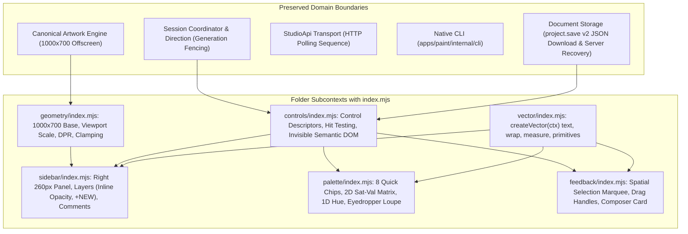

# Codesketch Studio Reconstruction Architecture Plan

## 1. Executive Summary & Authoritative Authorization

- **User Approval Date**: `2026-09-11`
- **Authorization**: Full reconstruction and release authorization granted by user; production implementation authorized to proceed while user is away.
- **Governance & Lead Role**:
  - **Manager Lead**: Codex (running in root `~/Code/codesketch`, pane `w6:p1`) leads architecture contracts, task decomposition, integration, and managed release with artwork backup. Task sequence, dependency hierarchy, and assignments are authoritatively managed via `bd` under epic `paint-2y5`.
  - **Designer Agent**: Gemini 3.8 Flash High (creative and writing only). Preserves frozen mockup references, writes architectural plans, standards, and acceptance specifications.
  - **Implementation Workers**: Small, bounded OpenCode workers execute implementation assignments. Per-file hard ceiling is 300 lines (preferably under 200); assignment target is around 500 changed lines including tests (split before 1000 lines).
  - **Independent Review**: Astra medium performs independent architectural and safety reviews prior to release.
- **Frozen Reference Baselines**:
  - Isolated Repository References: `docs/reference-mockup/index.html` and `docs/reference-mockup/overflow_demo.html` (frozen read-only).
  - Designer Origin: `/private/tmp/codesketch-designer-20260910-fresh/artifacts/mockup/index.html` (port 8088).
  - Handover Specification: `docs/designer-handover-specification.md`.
  - Acceptance Specification: `docs/specs/studio-reconstruction.feature`.
- **Core Directive**: Strictly zero feature creep. The application is reconstructed strictly based on the approved features in the frozen reference and no more.

---

## 2. Architecture Boundaries & System Context

The reconstruction retains all proven domain, direction, and communication boundaries while replacing the legacy DOM-mounted presentation shell with a high-performance, zero-CLS canvas workspace partitioned into dedicated folder subcontexts.



### 2.1 Preserved Boundaries (Untouched Contracts)
1. **Canonical Artwork Engine**: Multi-layer mark storage, deterministic local manual-stroke smoothing, and per-layer composition rendered to an offscreen 1000×700 canonical surface.
2. **Direction & Session Coordinator**: Authoritative human pause contract, control epoch fencing, generation/art revision validation, and heartbeat telemetry.
3. **Transport Protocol**: Sequenced mutation handling, reconnection guards, and snapshot distribution through `StudioApi` via HTTP polling (coalesced 100ms state polling loop). No WebSocket participation.
4. **Native CLI**: Native command-line toolchain under `apps/paint/internal/cli`, including artwork capture, offline operations, and the native CLI comment reply operation.
5. **Model/Intents Pipeline**: Unidirectional action flow through `createModel(state)`, immutable snapshot distribution, and local intent dispatching.
6. **Persistence & Recovery**: Real document serialization via `project.save` downloading authentic v2 JSON with explicit confirmation; server recovery on session reload.

### 2.2 Replaced Presentation (Studio Workspace Folder Subcontexts)
The legacy presentation (global header, left sidebar, central canvas stage, floating playback HUD, tool dock, right contextual inspector, and compact drawer rails) is completely superseded by the unified 1000×700 workspace organized into focused folder subcontexts under `apps/studio/src/studio/workspace/`, each exposing a public `index.mjs`:
1. `geometry/index.mjs`: Fixed 1000×700 design space, canvas boundary clamping (`x: 0..740` in expanded mode; `x: 0..1000` in collapsed mode), uniform viewport scaling, devicePixelRatio isolation without document data remapping.
2. `vector/index.mjs`: Vector typography and bounded primitives. Exports `createVector(ctx)` exposing methods:
   - `text(text, x, y, scale, color, size, opacity)`: Draws vector glyph strokes from `GLYPHS` dictionary with round caps/joins.
   - `wrap(text, maxWidth, scale)`: Wraps words within pixel widths.
   - `measure(text, scale)`: Returns number width in design units (no width/height object).
   - Bounded primitives: `rect`, `stroke`, `ellipse`, `roundRect`.
3. `controls/index.mjs`: Pure control descriptor generation (`{id, kind, x, y, width, height, label, action, payload, value, min, max, step, disabled}`), spatial hit-testing, and persistent invisible semantic DOM inputs for keyboard/IME/paste support.
4. `sidebar/index.mjs`: Right 260px inspector containing document header controls, layer stack hierarchy with inline opacity sliders and `+ NEW` layer creation, and comments review list with status badges.
5. `palette/index.mjs`: 8 preset pigment chips, active selection ring, 2D Saturation-Value picker, 1D Hue spectrum slider, recent mixes swatches, and canvas-pixel eyedropper loupe.
6. `feedback/index.mjs`: Spatial selection marquee with rectangle-aware bounds clamping origin to visible artwork region (`x: 0..740` expanded, `x: 0..1000` collapsed, `y: 0..700`) accounting for rectangle width and height (preserving stored comment bounds), 4 corner drag handles, live dimension badge (`[ 320 X 190 PX ]`), anchored review composer card, and generation/epoch-fenced review dispatch.

---

## 3. Detailed Technical Subsystems

### 3.1 Dual Rendering Pipeline & Coordinate System
- **Design Space**: Strictly 1000×700 design units across all calculations.
- **Offscreen Canonical Artwork Canvas**:
  - Renders raw artwork layers, vector marks, and layer transparency at native 1000×700 resolution.
  - Independent of UI overlays, marquee boxes, or inspector panels.
  - Serves as the source for eyedropper pixel sampling (sampling the displayed artwork composite without UI chrome).
  - PNG export renders the committed document on an isolated surface through the existing committed exporter, strictly excluding active playback, in-flight stroke previews, and local drafts (only `[ SAVE ]` is exposed by the final baseline UI).
- **Workspace UI Canvas**:
  - Renders the interactive chrome: header, tools, palette, layer cards, scrollbars, feedback marquee, and composer popover.
  - Composite view draws the canonical artwork underlay clamped to `x: 0..740` (or `0..1000` when collapsed), followed by vector UI chrome.
- **Uniform Viewport Scaling & DPR**:
  - The entire 1000×700 design space is scaled uniformly via CSS/canvas transform to fit available viewport dimensions (`Math.min(availW / 1000, availH / 700)`).
  - Canvas internal backing store multiplies width and height by `window.devicePixelRatio` for sharp rendering on retina displays.
  - **No document data remapping**: All internal pointer events, stroke coordinates, and review bounding boxes map linearly back to 1000×700 design space.
  - No extra zoom, pan, hand tool, or complex viewport cameras.

### 3.2 Control Descriptors & Invisible Semantic DOM
- **Control Descriptor Contract**:
  Every interactive UI element (button, slider, layer row, comment card, chip, text field) is declared as a plain JSON descriptor produced by renderer functions:
  ```typescript
  interface ControlDescriptor {
    id: string;
    kind: 'button' | 'slider' | 'toggle' | 'chip' | 'card' | 'input' | 'area';
    x: number;
    y: number;
    width: number;
    height: number;
    label: string;
    action: string;
    payload?: Record<string, unknown>;
    value?: number | string | boolean;
    min?: number;
    max?: number;
    step?: number;
    disabled?: boolean;
  }
  ```
- **Action Routing**:
  The workspace controller intercepts pointer events, performs hit detection against the active descriptor set, and routes `{action, payload}` to the application dispatcher or local state handler.
- **Persistent Invisible Semantic DOM Elements**:
  - Invisible, zero-opacity DOM elements (`<button>`, `<input type="range">`, `<textarea>`) are mounted in an overlaid container matching descriptor bounding boxes.
  - Visible typography, focus rings, hover states, and error indicators are rendered exclusively by vector paths on the canvas via `createVector(ctx)`.
  - Backing elements support keyboard navigation (`Tab`, `Enter`, `Space`), native IME text composition, screen reader accessibility trees, and system clipboard paste.

### 3.3 State Partitioning: Canonical Model vs Ephemeral UI
- **Canonical Model State** (Synchronized with server persistence from accepted snapshots):
  - Document layer collection (canonical IDs, names, bottom-to-top compositing order, visibility `visible: boolean`, opacity `opacity: number` 0..1)
  - Document strokes and committed artwork marks
  - Review threads and spatial comment bounds
  - Document save state and revision epoch
- **Local Application-Model State**:
  - Active tool (`brush`, `pencil`, `marker`, `eraser`, with visible UI labels `INK`, `PENCIL`, `MARK`, `ERASE`)
  - Brush parameters: Size (`1..100`), Opacity (`0..1`), Smoothing (`0..1`), Color (hex)
  - Review composer text draft in `model.review.text`
- **Ephemeral UI State** (Owned locally by Workspace Controller):
  - Sidebar collapse status (`isCollapsed: boolean`)
  - Layer list scroll offset (`layerScrollY: number`)
  - Comments list scroll offset (`commentScrollY: number`)
  - Comments active/all filter toggle (`filter: 'ACTIVE' | 'ALL'`)
  - Focused comment card ID
  - Pigment picker popover visibility and 2D reticle coordinates
  - Temporary visual feedback states (e.g. 2.5s "SAVED" confirmation state)

### 3.4 Brush, Eraser & Stroke Dynamics
- **Stroke Smoothing**:
  - Drawing relies on the canonical renderer plus deterministic local manual-stroke smoothing.
  - **Invariance**: The real-time interactive stroke preview and the committed mark store use the exact same smoothed points.
- **Eraser Dynamics**:
  - Eraser is a genuine per-layer transparency operation that clears alpha on the destination layer using `destination-out` composite blending.
  - **Bounded effective size**: `effectiveSize = Math.min(100, 2 * selectedBrushSize)`.
- **Sequential Layer Mutations & Ordering**:
  - Canonical layers composite bottom-to-top in document storage and display reversed (top layer first) in the UI layer stack.
  - Layer additions append to the document collection and activate the new layer upon acknowledgement, preserving the drawing tool. Mutations target actual canonical layer IDs with canonical fields `opacity` (0..1) and `visible` (boolean).
  - Rapid slider dragging coalesces opacity values into a single debounced mutation to prevent store flooding.
  - Active drawing tool context is strictly preserved during layer switching, opacity adjustments, and visibility toggling.

### 3.5 Review Lifecycle, Fencing & Comment Replies
- **Feedback SEND Fencing & Continuation**:
  - Entering review initiates a confirmed review pause capturing `generation`, `artRevision`, and `controlEpoch`.
  - Approved feedback `SEND` dispatches these captured guards along with a unique `requestId` and payload.
  - User explicitly hates a separate Resume step; approved `SEND` itself authorizes the submitted correction.
  - A pre-existing pause may be superseded by this explicit human `SEND`, never by background automation. This is not automatic resume. Do not add pause-provenance architecture or new UI controls.
  - Subsequent intentional pause or artwork changes during composition reject stale submit.
  - Uncertain transport retries preserve original payload and `requestId`.
  - On submission rejection or failure, composer draft text is preserved in `model.review.text`.
- **Real Agent Acknowledgement (ACK)**:
  - Demonstration fixture statuses are strictly forbidden in production.
  - A critique card's status pill displays `ACK` strictly upon receipt of genuine acknowledgement from an autonomous agent (agent-only, not human reviewer) via the review service.
  - Active filter (`ACTIVE`) is defined as `status !== 'resolved'`, covering `open`, `acknowledged`, and `addressed`.
  - Human resolution is the explicit transition that sets status to `resolved` and removes the item from `ACTIVE`.
- **Full Canonical Comment Reply API**:
  - Canonical native CLI reply operation: `paint comments reply <id> <text> --generation <generation> --seq <seq> --request-id <unique-id>`.
  - Input record fields: `author` (`human` | `agent`), `text`, `at`, `id`, `requestId`.
  - Bounded collection: maximum 32 replies per comment, maximum 2000 characters each.
  - Optional `replies` is current semantic data in schema—no deprecated legacy migration adapters.

### 3.6 Zero Cumulative Layout Shift (CLS) Invariant
- **Fixed Layout Geometry**:
  - Inspector sidebar width is fixed at 260px (`x: 740..1000`).
  - Comment cards maintain constant width 216px (`x: 752..968`).
  - Permanent 24px reserved gutter (`x: 968..1000`) for the floating paint-stroke scrollbar.
- **Measurement**:
  - No fake hardcoded CLS claims in production code.
  - Automated tests instantiate a `PerformanceObserver` tracking `layout-shift` entries to verify that switching filters between `[ 4 ACTIVE ]` and `[ 24 ALL ]` produces `CLS = 0.0000`.

---

## 4. Work Delegation & Management Governance

- **Authoritative Task Hierarchy**:
  Task breakdown, delegation sequence, and dependencies are managed authoritatively by the lead manager via `bd` under epic `paint-2y5`. Agents do not invent conflicting package sequences.
- **Coding Constraints for Workers**:
  - Per-file hard ceiling is strictly **300 lines** (target under 200).
  - Task assignment targets are around **500 changed lines** including tests (split before 1000).
  - Standard-library and browser APIs only; no external package installations.
- **Independent Astra Review Gate**:
  Astra medium reviews all worker integrations for contract conformance, safety, and line limits prior to staging.
- **Release Verification**:
  Final verification runs the full browser test suite and verifies against `docs/specs/studio-reconstruction.feature`. Managed release proceeds with full artwork store backup.

---

## 5. Browser Acceptance Criteria

Implementation acceptance must satisfy the following automated and visual browser criteria:
1. **Live Comment Replies**: Bounded reply collection displays real author/text replies in the composer card; CLI reply (`paint comments reply` via `apps/paint/internal/cli`) updates UI live.
2. **Native Paste & IME**: Invisible semantic inputs accept multi-byte IME characters and system clipboard paste events into feedback composer.
3. **Boundary Drag Clamping**: Drawing pointer dragged past `x = 740` cleanly halts stroke mark accumulation without leaking into inspector.
4. **Save Failure Recovery**: Simulated storage/network failure during `project.save` displays clear error indicator without corrupting local in-memory document state.
5. **Canonical Eraser Transparency**: Erasing with size `min(100, 2*selectedSize)` removes opacity on target layer, revealing underlay layers on composite canvas.
6. **Underlay-Safe Eyedropper & Committed PNG Exporter**: Eyedropper loupe samples the displayed artwork composite directly from the offscreen canvas without UI chrome interference. PNG export renders the committed document on an isolated surface through the existing committed exporter, strictly excluding active playback, in-flight previews, and local drafts (only `[ SAVE ]` is exposed by the final baseline UI).
7. **Zero Scrolling Reflow**: Scrolling layer stack and toggling comments filter produces strictly zero layout shifts (`CLS = 0.0000`).
